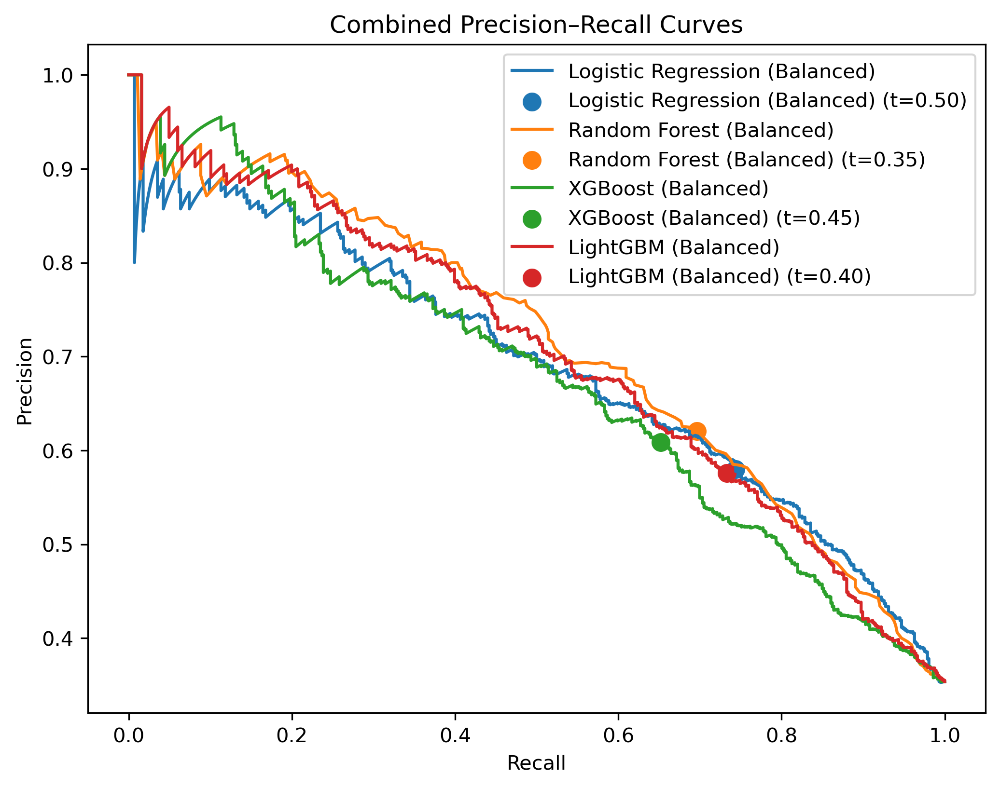

# StreamMax Fatigue Prediction Project

This repository contains my solution for the **StreamMax OTT Platform case competition**.  
# FATIGUE_PRED

A machine learning project for predicting user fatigue in OTT platforms, developed for the **StreamMax Case Competition**.

---

## 📌 Overview
This project aims to analyze user behavior on OTT platforms and predict fatigue levels.  
We use structured datasets (`ott_train.csv`, `ott_test.csv`) and apply advanced machine learning techniques to identify patterns that indicate user fatigue.  
The workflow is modular, with separate scripts for data exploration, preprocessing, modeling, hyperparameter tuning, blending, and testing.

---

## 🎯 Objectives
- Perform exploratory data analysis to understand fatigue drivers.
- Preprocess and clean raw OTT datasets for modeling.
- Train and evaluate multiple models (Logistic Regression, Random Forest, LightGBM).
- Blend models for improved accuracy and robustness.
- Generate final predictions for competition submission.
- Provide business insights and recommendations based on results.

---

## 📊 Data Exploration
| Metric | Visualization |
|--------|---------------|
| Subscription Tier |  |
| Completion Rate |  |
| Daily Minutes (7d) |  |
| Binge Sessions |  |
| Fatigue Label Distribution |  |
| Recommendation Click Rate |  |

👉 Open the dashboard notebook in `notebooks/05_blending_model.py` or explore the saved figures in the `reports/` folder.

---

## 🤖 Model Visualization
We provide clear visualizations of:
- Feature importance (LightGBM, Random Forest).
- SHAP values for explainability.
- ROC and PR curves comparing models.
- Confusion matrices for classification performance.

Figures are saved in the `reports/` folder:
- `fatigue_probability_distribution.png`
- `fatigue_probability_histogram.png`
- `roc_curve.png`
- `pr_curve.png`

---

## 📂 Final Prediction
The final prediction file is:
- **`Qubits_Predictions.csv`** → Contains 2,000 rows of user IDs with predicted fatigue probabilities.

This file is competition-ready and can be directly submitted to the leaderboard.

---

## 📊 Visualizations
### Fatigue Risk Distribution (Pie Chart)

### ROC Curve

### Precision-Recall Curve

