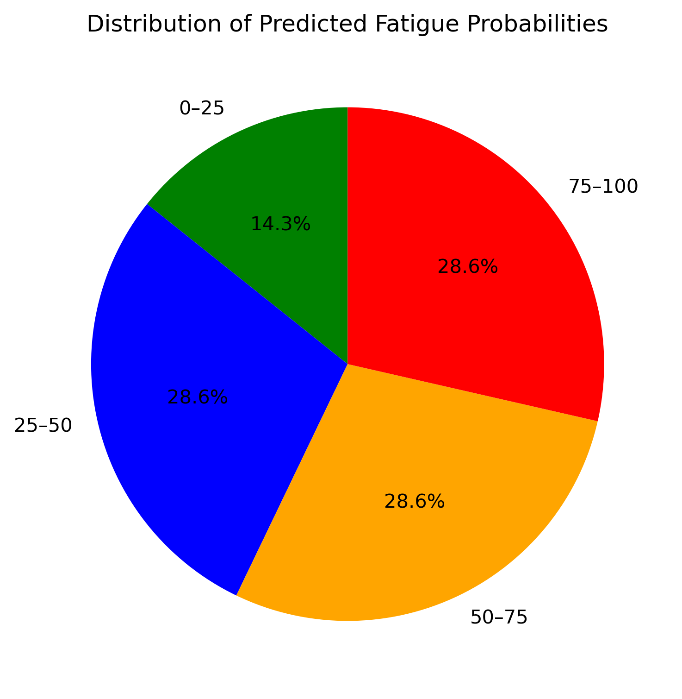

# StreamMax Fatigue Prediction Project

This repository contains my solution for the **StreamMax OTT Platform case competition**.  
It includes:
- 📊 Predictive modeling notebooks
- 📈 Visualizations (ROC curves, pie charts, histograms)
- 📂 Prediction files for leaderboard submission
- 📝 Presentation slides with business recommendations

---

## 📌 Project Structure
src/                # Source code for preprocessing, modeling, and plotting notebooks/          # Jupyter notebooks (training + test prediction) reports/            # Saved plots and prediction CSVs README.md           # Project documentation

---

## 🚀 Deliverables
- `Qubits_Predictions.csv` → Final prediction file (2,000 rows, probabilities).  
- `TeamName_Analysis.ipynb` → Notebook with preprocessing, modeling, and evaluation.  
- `TeamName_Presentation.pdf` → Business insights and recommendations.

---

## 📊 Visualizations
### Fatigue Risk Distribution (Pie Chart)

### ROC Curve

### Precision-Recall Curve

